# QUANTAXIS - AI 辅助开发文档

> **更新时间**: 2026年1月17日 09:13:03 CST
> **版本**: 2.1.0-alpha2
> **作者**: @yutiansut @quantaxis

---

## 变更记录 (Changelog)

### 2026-01-17 09:13:03 CST
- 📈 初始化 AI 辅助开发文档
- 🏗️ 建立模块索引和架构总览
- 📊 生成 Mermaid 模块结构图
- 🔗 添加模块间导航链接

---

## 项目愿景

QUANTAXIS 是一个**量化金融策略框架**，致力于为量化交易者提供从数据获取、策略开发、回测分析到实盘交易的全流程解决方案。

**核心特性**:
- 🦀 **Rust 高性能集成** - QARS2 核心提供 100x 性能提升
- 🔄 **跨语言零拷贝通信** - QADataSwap 实现 Python/Rust/C++ 无缝数据交换
- 📊 **多市场支持** - 股票/期货/期权/数字货币/港股/美股
- 🏛️ **统一账户协议** - QIFI 协议实现跨系统账户一致性
- 🚀 **微服务架构** - Docker/Kubernetes 云原生部署

---

## 架构总览

### 技术栈

**语言**:
- Python 3.9-3.12 (主开发语言)
- Rust (高性能核心组件)
- C++ (部分扩展实现)

**核心依赖**:
- 数据库: MongoDB 4.0+, ClickHouse 20.0+, Redis 5.0+
- Web框架: Tornado 6.4+, Flask 3.0+
- 数据处理: Pandas 2.0+, NumPy 1.24+, PyArrow 15.0+
- 消息队列: RabbitMQ (pika)
- 可选高性能: Polars 0.20+, QARS3 (Rust), QADataSwap

**部署**:
- 容器化: Docker, Docker Compose
- 编排: Kubernetes, Helm Charts
- 平台: Linux, macOS, Windows

---

## 模块结构图

```mermaid
graph TD
    A["(根) QUANTAXIS"] --> B["QUANTAXIS/"];
    A --> C["qapro-rs/"];
    A --> D["examples/"];
    A --> E["doc/"];
    A --> F["docker/"];

    B --> B1["QARSBridge"];
    B --> B2["QADataBridge"];
    B --> B3["QIFI"];
    B --> B4["QAMarket"];
    B --> B5["QAFetch"];
    B --> B6["QAData"];
    B --> B7["QAStrategy"];
    B --> B8["QAWebServer"];
    B --> B9["QASchedule"];
    B --> B10["QAFactor"];
    B --> B11["QAEngine"];
    B --> B12["QAPubSub"];
    B --> B13["QAUtil"];
    B --> B14["QASU"];
    B --> B15["QAAnalysis"];
    B --> B16["QAIndicator"];
    B --> B17["QASetting"];
    B --> B18["QACmd"];

    C --> C1["src/qamarket/"];
    C --> C2["src/qadata/"];

    D --> D1["qarsbridge_example.py"];
    D --> D2["qadatabridge_example.py"];
    D --> D3["resource_manager_example.py"];
    D --> D4["scheduleserver.py"];

    click B1 "./QUANTAXIS/QARSBridge/CLAUDE.md" "查看 QARSBridge 模块文档"
    click B2 "./QUANTAXIS/QADataBridge/CLAUDE.md" "查看 QADataBridge 模块文档"
    click B3 "./QUANTAXIS/QIFI/CLAUDE.md" "查看 QIFI 模块文档"
    click B4 "./QUANTAXIS/QAMarket/CLAUDE.md" "查看 QAMarket 模块文档"
    click B5 "./QUANTAXIS/QAFetch/CLAUDE.md" "查看 QAFetch 模块文档"
    click B6 "./QUANTAXIS/QAData/CLAUDE.md" "查看 QAData 模块文档"
    click B7 "./QUANTAXIS/QAStrategy/CLAUDE.md" "查看 QAStrategy 模块文档"
    click B8 "./QUANTAXIS/QAWebServer/CLAUDE.md" "查看 QAWebServer 模块文档"
    click B9 "./QUANTAXIS/QASchedule/CLAUDE.md" "查看 QASchedule 模块文档"
    click B10 "./QUANTAXIS/QAFactor/CLAUDE.md" "查看 QAFactor 模块文档"
    click B11 "./QUANTAXIS/QAEngine/CLAUDE.md" "查看 QAEngine 模块文档"
    click B12 "./QUANTAXIS/QAPubSub/CLAUDE.md" "查看 QAPubSub 模块文档"
    click B13 "./QUANTAXIS/QAUtil/CLAUDE.md" "查看 QAUtil 模块文档"
    click B14 "./QUANTAXIS/QASU/CLAUDE.md" "查看 QASU 模块文档"
    click B15 "./QUANTAXIS/QAAnalysis/CLAUDE.md" "查看 QAAnalysis 模块文档"
    click B16 "./QUANTAXIS/QAIndicator/CLAUDE.md" "查看 QAIndicator 模块文档"
    click B17 "./QUANTAXIS/QASetting/CLAUDE.md" "查看 QASetting 模块文档"
    click B18 "./QUANTAXIS/QACmd/CLAUDE.md" "查看 QACmd 模块文档"
    click C "./qapro-rs/CLAUDE.md" "查看 qapro-rs 文档"
```



---

## 模块索引

| 模块名称 | 路径 | 主要语言 | 职责描述 | 文档链接 |
|---------|------|---------|---------|---------|
| **QARSBridge** | `QUANTAXIS/QARSBridge/` | Python/Rust | Rust高性能账户和回测引擎桥接层 (100x加速) | [查看](./QUANTAXIS/QARSBridge/CLAUDE.md) |
| **QADataBridge** | `QUANTAXIS/QADataBridge/` | Python/Rust | 跨语言零拷贝数据交换 (5-10x加速) | [查看](./QUANTAXIS/QADataBridge/CLAUDE.md) |
| **QIFI** | `QUANTAXIS/QIFI/` | Python | 统一账户协议 (QIFI) 账户和账户管理器 | [查看](./QUANTAXIS/QIFI/CLAUDE.md) |
| **QAMarket** | `QUANTAXIS/QAMarket/` | Python | 市场预设、订单和持仓管理 | [查看](./QUANTAXIS/QAMarket/CLAUDE.md) |
| **QAFetch** | `QUANTAXIS/QAFetch/` | Python | 多市场数据获取 (TDX/Tushare/加密货币) | [查看](./QUANTAXIS/QAFetch/CLAUDE.md) |
| **QAData** | `QUANTAXIS/QAData/` | Python | 内存数据库和数据结构 | [查看](./QUANTAXIS/QAData/CLAUDE.md) |
| **QAStrategy** | `QUANTAXIS/QAStrategy/` | Python | 策略回测框架 (CTA/套利/因子) | [查看](./QUANTAXIS/QAStrategy/CLAUDE.md) |
| **QAWebServer** | `QUANTAXIS/QAWebServer/` | Python | Tornado Web服务器和RESTful API | [查看](./QUANTAXIS/QAWebServer/CLAUDE.md) |
| **QASchedule** | `QUANTAXIS/QASchedule/` | Python | 任务调度和后台作业管理 | [查看](./QUANTAXIS/QASchedule/CLAUDE.md) |
| **QAFactor** | `QUANTAXIS/QAFactor/` | Python | 因子研究、分析、回测框架 | [查看](./QUANTAXIS/QAFactor/CLAUDE.md) |
| **QAEngine** | `QUANTAXIS/QAEngine/` | Python | 异步计算引擎和任务调度 | [查看](./QUANTAXIS/QAEngine/CLAUDE.md) |
| **QAPubSub** | `QUANTAXIS/QAPubSub/` | Python | RabbitMQ消息队列封装 | [查看](./QUANTAXIS/QAPubSub/CLAUDE.md) |
| **QAUtil** | `QUANTAXIS/QAUtil/` | Python | 工具函数和资源管理器 | [查看](./QUANTAXIS/QAUtil/CLAUDE.md) |
| **QASU** | `QUANTAXIS/QASU/` | Python | 数据保存和存储管理 | [查看](./QUANTAXIS/QASU/CLAUDE.md) |
| **QAAnalysis** | `QUANTAXIS/QAAnalysis/` | Python | 数据分析和统计模块 | [查看](./QUANTAXIS/QAAnalysis/CLAUDE.md) |
| **QAIndicator** | `QUANTAXIS/QAIndicator/` | Python | 技术指标计算和自定义 | [查看](./QUANTAXIS/QAIndicator/CLAUDE.md) |
| **QASetting** | `QUANTAXIS/QASetting/` | Python | 配置管理和本地化设置 | [查看](./QUANTAXIS/QASetting/CLAUDE.md) |
| **QACmd** | `QUANTAXIS/QACmd/` | Python | 命令行接口 (CLI) | [查看](./QUANTAXIS/QACmd/CLAUDE.md) |
| **qapro-rs** | `qapro-rs/` | Rust | QUANTAXIS Rust 实现 | [查看](./qapro-rs/CLAUDE.md) |

---

## 运行与开发

### 环境要求

- **Python**: 3.9 - 3.12 (推荐 3.11+)
- **MongoDB**: 4.0+ (数据存储)
- **ClickHouse**: 20.0+ (可选，高性能分析)
- **RabbitMQ**: 3.8+ (可选，消息队列)
- **Redis**: 5.0+ (可选，缓存)

### 安装方式

```bash
# 克隆项目
git clone https://github.com/QUANTAXIS/QUANTAXIS.git
cd QUANTAXIS

# 基础安装
pip install -e .

# 包含 Rust 组件 (推荐 - 100x性能)
pip install -e .[rust]

# 包含性能优化包
pip install -e .[performance]

# 完整安装
pip install -e .[full]
```

### 快速开始

```python
import QUANTAXIS as QA
from QUANTAXIS.QARSBridge import QARSAccount, has_qars_support

# 检查 Rust 支持
if has_qars_support():
    print("Rust 核心可用，将获得极致性能")

# 创建高性能账户
account = QARSAccount("my_strategy", init_cash=1000000)

# 股票交易
account.buy("000001", 10.5, "2025-01-15", 1000)
account.sell("000001", 10.8, "2025-01-16", 500)

# 期货交易
account.buy_open("IF2512", 4500.0, "2025-01-15", 2)
account.sell_close("IF2512", 4520.0, "2025-01-16", 1)

# 查询持仓
positions = account.get_positions()
print(positions)
```

### 命令行工具

```bash
# 启动 Quantaxis
quantaxis

# 启动 Web 服务器
qawebserver

# 运行策略
qarun your_strategy.py
```

### Docker 部署

```bash
# 启动完整服务栈 (MongoDB + RabbitMQ + QUANTAXIS)
cd docker/qa-service-v2.1
docker-compose up -d

# 访问 Web UI
http://localhost:8080
```

---

## 测试策略

### 单元测试

```bash
# 运行所有测试
pytest QUANTAXIS/

# 运行特定模块测试
pytest QUANTAXIS/QARSBridge/
pytest QUANTAXIS/QIFI/

# 带覆盖率报告
pytest --cov=QUANTAXIS QUANTAXIS/
```

### 集成测试

```bash
# 数据库连接测试
python scripts/test_dependencies.py

# 向后兼容性测试
python scripts/test_backward_compatibility.py

# ClickHouse 集成测试
python examples/test_ckread_qifi.py
```

### 性能基准测试

```bash
# QARS2 vs Python 性能对比
python examples/qarsbridge_example.py

# 运行性能测试
python -m pytest QUANTAXIS/QARSBridge/tests/test_performance.py
```

---

## 编码规范

### Python 代码风格

- 遵循 **PEP 8** 规范
- 使用 **Type Hints** 提供类型提示
- 文档字符串使用 **Google Style**

```python
from typing import Optional, List

def example_function(param1: str, param2: Optional[int] = None) -> bool:
    """
    示例函数

    Args:
        param1: 第一个参数
        param2: 可选的第二个参数

    Returns:
        bool: 返回值

    Raises:
        ValueError: 当参数无效时
    """
    if not param1:
        raise ValueError("param1 不能为空")
    return True
```

### Rust 代码风格

- 使用 `cargo fmt` 格式化
- 使用 `cargo clippy` 检查代码质量
- 遵循 Rust 官方风格指南

```bash
# 格式化代码
cargo fmt

# 检查代码
cargo clippy -- -D warnings

# 运行测试
cargo test
```

### 命名约定

- **模块名**: 小写加下划线 (`qars_bridge`)
- **类名**: 大驼峰 (`QARSAccount`)
- **函数/方法**: 小写加下划线 (`buy_open`)
- **常量**: 全大写加下划线 (`HAS_QARS`)

---

## AI 使用指引

### 项目结构理解

1. **核心业务逻辑** 在 `QUANTAXIS/` 目录
2. **高性能组件** 使用 Rust 实现 (`qapro-rs/`)
3. **数据获取** 统一通过 `QAFetch` 模块
4. **账户管理** 使用 QIFI 协议 (`QIFI/`, `QARSBridge/`)
5. **Web 服务** 基于 Tornado (`QAWebServer/`)

### 常见任务

#### 添加新的数据源

1. 在 `QUANTAXIS/QAFetch/` 创建新文件
2. 实现 `QA_fetch_get_xxx` 系列函数
3. 在 `QAFetch/__init__.py` 导出接口
4. 更新文档和示例

#### 实现新的策略基类

1. 在 `QUANTAXIS/QAStrategy/` 创建新文件
2. 继承 `QAStrategyCtaBase` 或创建新的基类
3. 实现必需的回调方法
4. 添加示例和测试

#### 添加新的技术指标

1. 在 `QUANTAXIS/QAIndicator/` 添加函数
2. 使用 NumPy/Pandas 向量化操作
3. 在 `__init__.py` 导出
4. 添加单元测试

### 代码审查要点

- 是否正确处理异常
- 是否有内存泄漏风险
- 是否支持多市场/多周期
- 是否符合 QIFI 协议规范
- 是否有充分的测试覆盖

---

## 相关项目

- **QARS2**: https://github.com/yutiansut/qars2 - QUANTAXIS Rust 核心
- **QADataSwap**: https://github.com/QUANTAXIS/qadataswap - 跨语言零拷贝通信
- **QAEXCHANGE-RS**: https://github.com/yutiansut/qaexchange-rs - Rust 交易所

---

## 许可证

MIT License

---

## 联系方式

- **作者**: yutiansut
- **Email**: yutiansut@qq.com
- **GitHub**: https://github.com/QUANTAXIS/QUANTAXIS
- **文档**: https://github.com/QUANTAXIS/QUANTAXIS/blob/master/doc/README.md
