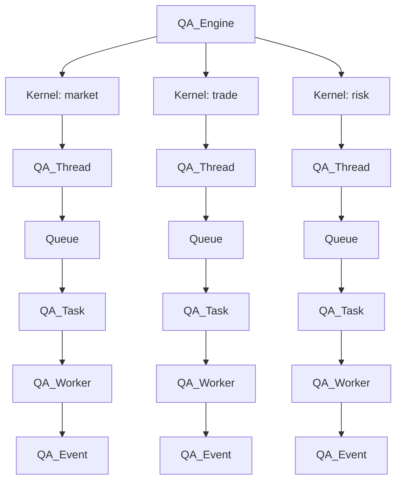

# QAEngine 模块文档

[根目录](../../CLAUDE.md) > [QUANTAXIS](../) > **QAEngine**

---

> **版本**: 2.0.0
> **作者**: @yutiansut @quantaxis
> **语言**: Python

---

## 变更记录 (Changelog)

### 2026-01-17 09:36:13 CST
- 📈 添加事件驱动架构详细文档
- 📈 添加 QA_Event 和 QA_Worker API 文档
- 📈 添加多线程引擎 QA_Engine 使用示例
- 📈 添加异步任务和调度器文档
- ✨ 新增完整的生产者-消费者模式示例

### 2026-01-17 09:13:03 CST
- 📈 初始化模块文档

---

## 模块职责

QAEngine 提供**异步计算引擎和任务调度**：

- **事件驱动架构**: 基于事件的任务分发
- **多线程引擎**: 生产者-消费者模式
- **异步任务**: 支持回调的异步任务
- **异步调度器**: 定时任务调度

---

## 入口与启动

```python
from QUANTAXIS.QAEngine import (
    QA_Engine,
    QA_Event,
    QA_Task,
    QA_Worker,
    QA_Thread,
    QA_AsyncQueue,
    QA_AsyncScheduler,
    create_QAAsyncScheduler,
)
```

---

## 事件驱动架构

### QA_Event - 事件对象

事件是系统中最小的执行单元，携带执行所需的信息。

```python
class QA_Event:
    def __init__(
        self,
        event_type=None,     # 事件类型
        func=None,           # 要执行的函数
        message=None,        # 事件消息
        callback=False,      # 回调函数
        *args,
        **kwargs
    ):
```

**创建事件**:

```python
from QUANTAXIS.QAEngine import QA_Event

# 简单事件
event = QA_Event(
    event_type='market_data',
    message='New bar data received'
)

# 带函数的事件
def my_function(param1, param2):
    print(f"执行: {param1}, {param2}")

event = QA_Event(
    event_type='task',
    func=my_function,
    message='Executing task'
)

# 带自定义参数的事件
event = QA_Event(
    event_type='order',
    code='000001',
    price=10.5,
    volume=1000,
    direction='BUY'
)

# 访问自定义参数
print(event.code)     # '000001'
print(event.price)    # 10.5
```

### QA_Worker - 工作单元

Worker 是执行事件的抽象基类，必须实现 `run()` 方法。

```python
from QUANTAXIS.QAEngine import QA_Worker, QA_Event

class MyWorker(QA_Worker):
    def __init__(self):
        super().__init__()
        self.type = 'MyWorker'

    def run(self, event: QA_Event):
        """
        执行事件

        Args:
            event: QA_Event 对象
        """
        print(f"Worker {self.type} 处理事件: {event.event_type}")
        # 处理逻辑
        result = process_event(event)
        return result
```

**内置 Worker 示例**:

```python
# 账户 Worker
class AccountWorker(QA_Worker):
    def run(self, event):
        if event.event_type == 'order':
            # 处理订单
            self.execute_order(event.code, event.price, event.volume)
        elif event.event_type == 'settle':
            # 执行结算
            self.settle()

# 数据 Worker
class DataWorker(QA_Worker):
    def run(self, event):
        if event.event_type == 'fetch':
            # 获取数据
            data = self.fetch_data(event.code, event.start, event.end)
            return data
```

### QA_Task - 任务单元

Task 是 Worker 和 Event 的组合，代表一个可执行的单元。

```python
from QUANTAXIS.QAEngine import QA_Task, QA_Worker, QA_Event

worker = MyWorker()
event = QA_Event(event_type='test', message='Test event')

# 创建任务
task = QA_Task(
    worker=worker,      # 执行任务的 worker
    event=event,        # 要处理的事件
    engine=None,        # 指定引擎 (可选)
    callback=None       # 回调函数 (可选)
)

# 执行任务
task.do()

# 获取结果
result = task.result
print(f"任务结果: {result}")
```

**带回调的任务**:

```python
def on_complete(result):
    print(f"任务完成，结果: {result}")

task = QA_Task(
    worker=worker,
    event=event,
    callback=on_complete
)

task.do()  # 执行后会自动调用 on_complete
```

---

## 多线程引擎

### QA_Thread - 线程基类

基于 `threading.Thread` 的线程类，内置任务队列。

```python
from QUANTAXIS.QAEngine import QA_Thread, QA_Task

# 创建线程
thread = QA_Thread(
    name='MyThread',  # 线程名称 (可选)
    daemon=False      # 是否为守护线程 (可选)
)

# 启动线程
thread.start()

# 提交任务
task = QA_Task(worker=worker, event=event)
thread.put(task)

# 暂停线程
thread.pause()

# 恢复线程
thread.resume()

# 停止线程
thread.stop()
```

**自定义 Worker 线程**:

```python
class MarketDataThread(QA_Thread):
    def __init__(self, codes):
        super().__init__(name='MarketData')
        self.codes = codes
        self.workers = {
            'fetch': DataFetchWorker(),
            'process': DataProcessWorker()
        }

    def run(self):
        """主循环 - 自动处理队列中的任务"""
        # QA_Thread 的 run 方法已实现
        # 会自动从队列获取任务并执行
        super().run()

    def add_fetch_task(self, code):
        event = QA_Event(
            event_type='fetch',
            code=code,
            start='2024-01-01',
            end='2024-12-31'
        )
        task = QA_Task(
            worker=self.workers['fetch'],
            event=event,
            engine='fetch'
        )
        self.put(task)
```

### QA_Engine - 多引擎管理

管理多个线程的引擎，支持任务分发到不同线程。

```python
from QUANTAXIS.QAEngine import QA_Engine, QA_Task, QA_Event, QA_Worker

# 创建引擎
engine = QA_Engine()

# 创建并注册内核 (线程)
engine.create_kernel('market', daemon=False)
engine.create_kernel('trade', daemon=False)
engine.create_kernel('risk', daemon=False)

# 启动所有内核
for name in ['market', 'trade', 'risk']:
    engine.start_kernel(name)

# 启动引擎主线程
engine.start()

# 提交任务到指定内核
market_worker = MarketDataWorker()
market_event = QA_Event(event_type='fetch', code='000001')

task = QA_Task(
    worker=market_worker,
    event=market_event,
    engine='market'  # 指定由 market 内核处理
)

engine.run_job(task)  # 任务会被分发到 market 内核

# 提交任务到主引擎
task2 = QA_Task(
    worker=SomeWorker(),
    event=QA_Event(event_type='main'),
    engine=None  # None 表示由主引擎处理
)

engine.put(task2)

# 停止单个内核
engine.stop_kernel('risk')

# 停止所有内核
engine.stop_all()

# 等待所有任务完成
engine.join()
```

**完整示例 - 量化交易引擎**:

```python
class QuantEngine:
    """
    量化交易引擎

    三个内核:
    - market: 行情数据处理
    - trade: 交易执行
    - risk: 风险控制
    """

    def __init__(self):
        self.engine = QA_Engine()
        self.setup_kernels()

    def setup_kernels(self):
        # 创建内核
        self.engine.create_kernel('market')
        self.engine.create_kernel('trade')
        self.engine.create_kernel('risk')

        # 创建 Workers
        self.market_worker = MarketWorker()
        self.trade_worker = TradeWorker()
        self.risk_worker = RiskWorker()

    def start(self):
        # 启动所有内核
        for name in ['market', 'trade', 'risk']:
            self.engine.start_kernel(name)

        # 启动引擎
        self.engine.start()

    def process_market_data(self, code, data):
        """处理行情数据"""
        event = QA_Event(
            event_type='market_data',
            code=code,
            data=data
        )
        task = QA_Task(
            worker=self.market_worker,
            event=event,
            engine='market'
        )
        self.engine.run_job(task)

    def submit_order(self, order):
        """提交订单"""
        event = QA_Event(
            event_type='order',
            order=order
        )
        task = QA_Task(
            worker=self.trade_worker,
            event=event,
            engine='trade'
        )
        self.engine.run_job(task)

    def check_risk(self, account):
        """风险检查"""
        event = QA_Event(
            event_type='risk_check',
            account=account
        )
        task = QA_Task(
            worker=self.risk_worker,
            event=event,
            engine='risk'
        )
        self.engine.run_job(task)

    def stop(self):
        self.engine.stop_all()

# 使用
quant_engine = QuantEngine()
quant_engine.start()

# 处理行情
quant_engine.process_market_data('000001', market_data)

# 提交订单
quant_engine.submit_order(order)

# 风险检查
quant_engine.check_risk(account)

# 停止
quant_engine.stop()
```

---

## 异步任务

### QA_AsyncThread - 异步线程

支持异步操作的线程。

```python
from QUANTAXIS.QAEngine.QAAsyncThread import QA_AsyncThread, QA_AsyncQueue

# 创建异步队列
queue = QA_AsyncQueue()

# 创建异步线程
async_thread = QA_AsyncThread(queue=queue)

async_thread.start()

# 添加异步任务
await async_thread.process_async(some_async_function)
```

### QA_AsyncTask - 异步任务

```python
from QUANTAXIS.QAEngine.QAAsyncTask import QA_AsyncTask

async_task = QA_AsyncTask(
    func=my_async_function,
    args=(arg1, arg2),
    kwargs={'key': 'value'}
)

result = await async_task.execute()
```

### QA_AsyncScheduler - 异步调度器

```python
from QUANTAXIS.QAEngine import create_QAAsyncScheduler

# 创建调度器
scheduler = create_QAAsyncScheduler()

# 添加定时任务
scheduler.add_job(
    func=my_task,
    trigger='interval',
    seconds=60,
    id='task1'
)

# 启动调度器
scheduler.start()

# 移除任务
scheduler.remove_job('task1')

# 关闭调度器
scheduler.shutdown()
```

---

## 完整示例

### 示例1: 简单事件处理

```python
from QUANTAXIS.QAEngine import QA_Event, QA_Worker, QA_Task, QA_Thread

# 1. 定义 Worker
class PrintWorker(QA_Worker):
    def __init__(self):
        super().__init__()
        self.type = 'Printer'

    def run(self, event):
        print(f"处理事件: {event.message}")
        if hasattr(event, 'data'):
            print(f"数据: {event.data}")
        return f"已处理: {event.event_type}"

# 2. 创建线程
thread = QA_Thread(name='PrinterThread')
thread.start()

# 3. 创建事件和任务
worker = PrintWorker()
event = QA_Event(
    event_type='print',
    message='Hello World',
    data={'key': 'value'}
)
task = QA_Task(worker=worker, event=event)

# 4. 提交任务
thread.put(task)

# 5. 等待完成
thread.queue.join()
thread.stop()
```

### 示例2: 数据处理流水线

```python
from QUANTAXIS.QAEngine import QA_Engine, QA_Event, QA_Task, QA_Worker

# Worker 1: 数据获取
class FetchWorker(QA_Worker):
    def run(self, event):
        print(f"获取数据: {event.code}")
        # 模拟获取数据
        return {'code': event.code, 'price': 10.5, 'volume': 1000}

# Worker 2: 数据处理
class ProcessWorker(QA_Worker):
    def run(self, event):
        print(f"处理数据: {event.data}")
        # 模拟处理
        return {'processed': True, 'result': event.data['price'] * 2}

# Worker 3: 结果保存
class SaveWorker(QA_Worker):
    def run(self, event):
        print(f"保存结果: {event.result}")
        # 模拟保存
        return {'saved': True}

# 创建引擎
engine = QA_Engine()
engine.create_kernel('fetch')
engine.create_kernel('process')
engine.create_kernel('save')

# 启动
for name in ['fetch', 'process', 'save']:
    engine.start_kernel(name)

engine.start()

# 流水线
def process_pipeline(code):
    # 1. 获取数据
    fetch_event = QA_Event(event_type='fetch', code=code)
    fetch_task = QA_Task(
        worker=FetchWorker(),
        event=fetch_event,
        engine='fetch'
    )
    engine.run_job(fetch_task)

    # 2. 处理数据
    process_event = QA_Event(event_type='process', data=fetch_task.result)
    process_task = QA_Task(
        worker=ProcessWorker(),
        event=process_event,
        engine='process'
    )
    engine.run_job(process_task)

    # 3. 保存结果
    save_event = QA_Event(event_type='save', result=process_task.result)
    save_task = QA_Task(
        worker=SaveWorker(),
        event=save_event,
        engine='save'
    )
    engine.run_job(save_task)

    return save_task.result

# 执行
result = process_pipeline('000001')
print(f"最终结果: {result}")

# 清理
engine.stop_all()
engine.join()
```

### 示例3: 带回调的异步任务

```python
from QUANTAXIS.QAEngine import QA_Event, QA_Task, QA_Worker, QA_Engine

class CalculationWorker(QA_Worker):
    def run(self, event):
        result = event.a + event.b
        return result

def on_success(result):
    print(f"计算成功: {result}")

def on_error(error):
    print(f"计算失败: {error}")

# 创建任务
worker = CalculationWorker()
event = QA_Event(event_type='add', a=10, b=20)

task = QA_Task(
    worker=worker,
    event=event,
    callback=lambda res: print(f"回调: {res}")
)

# 执行
task.do()
print(task.result)
```

---

## 架构图



---

## 关键依赖

```python
# 标准库
threading
queue
asyncio

# QUANTAXIS 内部
QUANTAXIS.QAUtil
```

---

## 最佳实践

### 1. 线程安全

```python
import threading

class SafeWorker(QA_Worker):
    def __init__(self):
        super().__init__()
        self.lock = threading.Lock()
        self.data = []

    def run(self, event):
        with self.lock:
            self.data.append(event.data)
```

### 2. 错误处理

```python
class RobustWorker(QA_Worker):
    def run(self, event):
        try:
            result = self.process(event)
            return result
        except Exception as e:
            print(f"错误: {e}")
            # 返回错误结果
            return {'error': str(e)}
```

### 3. 资源清理

```python
def cleanup_engine(engine):
    """清理引擎资源"""
    # 停止所有内核
    engine.stop_all()

    # 等待队列清空
    engine.join()

    # 清空内核字典
    engine.kernels_dict.clear()
```

---

## 相关文件清单

```
QUANTAXIS/QAEngine/
├── __init__.py              # 模块入口
├── QAEvent.py               # 事件和工作单元
├── QATask.py                # 任务单元
├── QAThreadEngine.py        # 线程引擎
├── QAAsyncThread.py         # 异步线程
├── QAAsyncTask.py           # 异步任务
└── QAAsyncSchedule.py       # 异步调度器
```

---

## 下一步

- 查看: [QAStrategy](../QAStrategy/CLAUDE.md) | [QAPubSub](../QAPubSub/CLAUDE.md) | [QASchedule](../QASchedule/CLAUDE.md)
